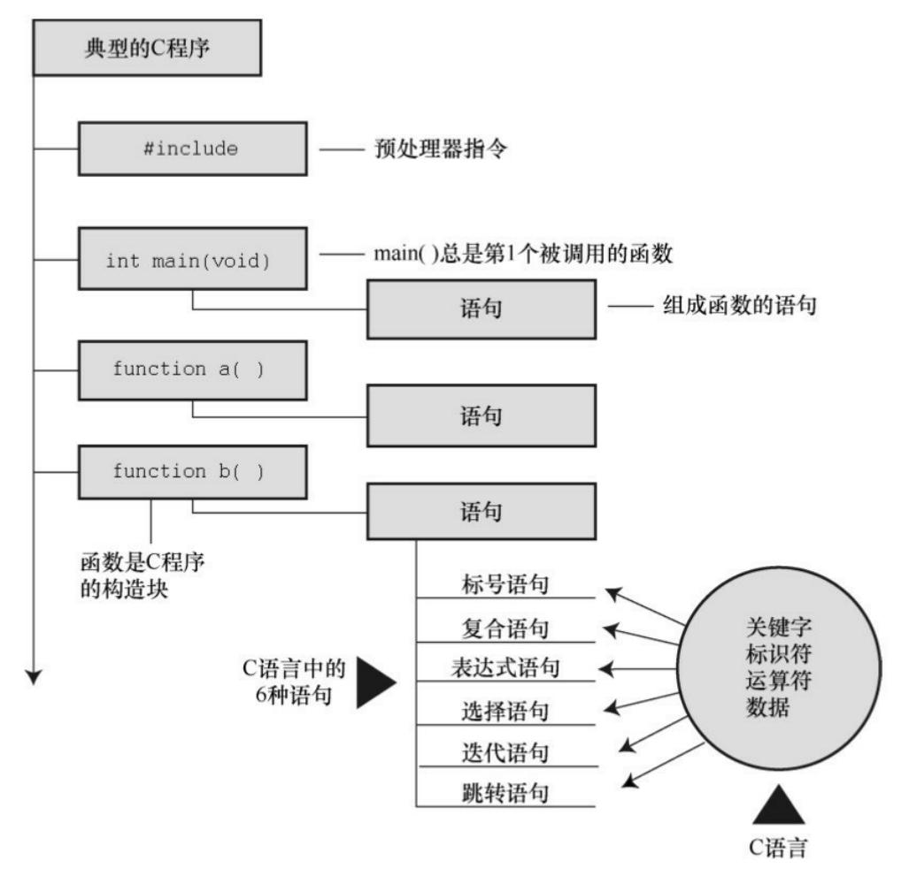

# C语言概括

## 一个简单的C程序示例

```c
#include <stdio.h> /* 预处理指令，包含stdio.h头文件 */

int main(void) {
    int num = 0; /* 声明一个整数变量 */
    num = 1; /* 给变量赋值 */
    printf("print"); /* 使用printf函数将字符串输出到标准输出 */
    printf("something.\n");
    printf("print num  %d to stdout.\n", num);
    return 0;
}
```

## 组成



## 预处理指令

```c
#include <stdio.h>
```

这行代码是预处理指令，C语言编译器在编译前会对源代码做一些准备工作。

它告诉编译器把`stdio.h`文件的内容插入到当前文件中。`stdio.h`是C语言编译器软件包的标准部分，它提供了键盘输入和屏幕输出的支持。

在C语言顶部的这些信息集合，称为`头文件`。

## 注释

```c
1. /* 预处理指令，包含stdio.h头文件 */
2. /* 这是一个注释 */
3. // 这是一个注释
4. /*
        这是一个注释
    */
```

这行代码是注释，它不会被编译器处理，只是用来给程序员自己看的。

## 函数

```c
int main(void) {
    ...
}
```

C程序包含一个或多个函数，它们是C程序的基本模块。

此处定义了一个名为`main`的函数，`int` 表示函数返回值的类型，main函数的返回值类型为整数。`void` 表示函数没有参数。

`main`是一个特殊函数，它是C程序执行的入口点。

`{` 和 `}` 是大括号，左括号表示函数定义的开始，右括号表示函数的结束。

## 变量

```c
int num = 0;
num = 1;
```

这条语句是声明和赋值语句。

`int` 表示变量的类型，这里是一个整数变量。

`num` 是变量的名称，`= 0` 表示变量的初始值，表示`num`的值为0。

`num = 1;`是赋值语句，表示给`num`赋值为1。

声明时，编译器在计算机内存中为变量num预留了空间，然后在执行这行赋值表达式语句时，把值储存在之前预留的位置。

## 函数调用

```c
printf("print");
printf("something.\n");
printf("print num  %d to stdout.\n", num);
``````

此处调用了printf函数.`\n`表示换行字符。

`%d`是C语言中格式化输出的占位符，表示在这个位置输出一个整数。

```c
return 0;
```

`return` 表示函数的返回值，`0`表示函数正常结束。