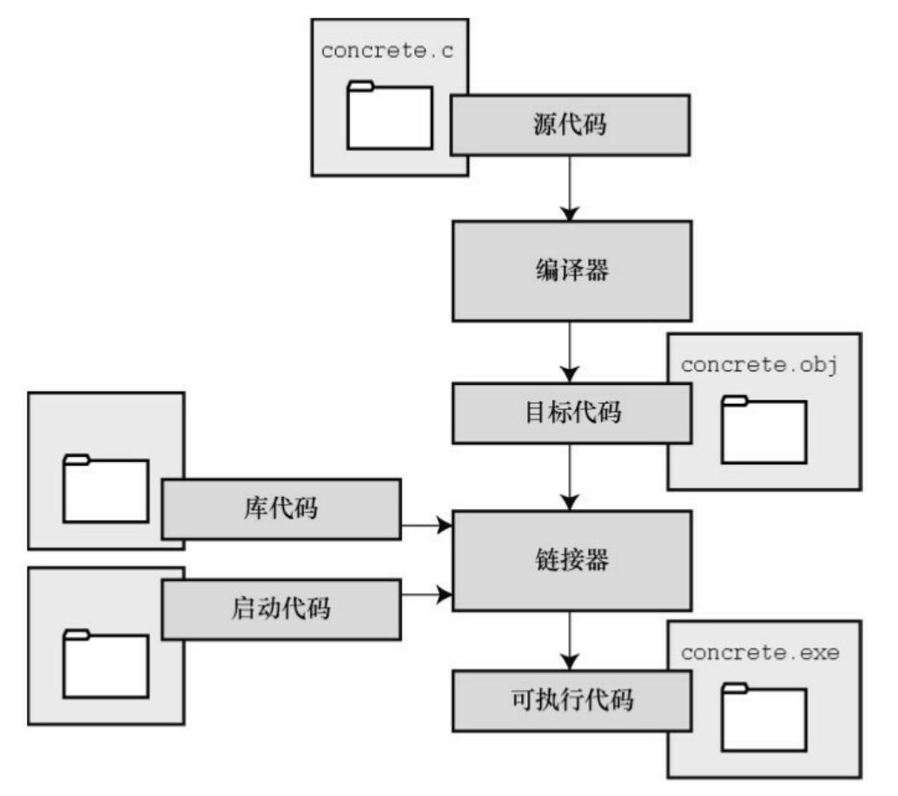

# 1.programming

## 程序

### 什么是程序

`程序`是一组计算机能识别和执行的指令，运行于电子计算机上，满足人们某种需求的信息化工具。 `程序设计`（programming），是给出解决特定问题程序的过程，软件开发过程中的重要步骤。程序设计往往以某种程序设计语言为工具，给出这种语言下的程序。程序设计过程一般包括分析、设计、编码、测试、调试等不同阶段。

`计算机语言`是人和计算机交流信息需要解决语言问题,需要创造一种计算机和人都能识别的语言.

`高级语言`是从人类的逻辑思维角度出发的计算机语言，抽象程度大大提高，需要经过编译成特定机器上的目标代码才能执行，一条高级语言的语句往往需要若干条机器指令来完成。高级语言独立于机器的特性是靠编译器为不同机器生成不同的目标代码\(或机器指令\)来实现的。

### 组成

- 源程序：指未编译的按照一定的程序设计语言规范书写的文本文件，是一系列人类可读的计算机语言指令

- 目标程序：为源程序经编译可直接被计算机运行的机器码集合，在计算机文件上以.obj作扩展名

- 可执行程序：将所有编译后得到的目标模块连接装配起来，在与函数库相连接成为一个整体，生成一个可供计算机执行的目标程序，成为可执行程序

### 编译过程

C编译的基本策略是，用程序把源代码文件转换为可执行文件（其中包含可直接运行的机器语言代码）。
典型的C实现通过**编译**和**链接**两个步骤来完成这一过程。

编译器把源代码转换成中间代码，链接器把中间代码和其他代码合并，生成可执行文件。C 使用这种分而治之的方法方便对程序进行模块化，可以独立编译单独的模块，稍后再用链接器合并已编译的模块。通过这种方式，如果只更改某个模块，不必因此重新编译其他模块。另外，链接器还将你编写的程序和预编译的库代码合并。

#### 编辑

上机输入或者编辑源程序，用C语言编写程序时，编写的内容被储存在文本文件中，这些文本文件一般都是以`.c`结尾，该文件被称为源代码文件（`source code file`）

下面是一个简单的C语言程序(HelloWorld.c)：

```c
#include<stdio.h>

int main(void)
{
    printf("Hello World!\n");
    return 0;
}
```

#### 编译

把源代码转换为机器语言代码，并把结果放在目标代码文件（或简称目标文件）中。虽然目标文件中包含机器语言代码，但是并不能直接运行该文件。

因为目标文件中储存的是编译器翻译的源代码，这还不是一个完整的程序，目标文件中缺少：

> 1. 启动代码（startup code）
>
>       启动代码充当着程序和操作系统之间的接口。例如，可以在MS Windows或Linux系统下运行IBM PC兼容机。这两种情况所使用的硬件相同，所以目标代码相同，但是Windows和Linux所需的启动代码不同，因为这些系统处理程序的方式不同。
> 2. 库函数
>
>       几乎所有的C程序都要使用C标准库中的函数。例如，HelloWorld.c中就使用了 printf()函数。目标代码文件并不包含该函数的代码，它只包含了使用printf()函数的指令。printf()函数真正的代码储存在另一个被称为库的文件中。库文件中有许多函数的目标代码。


* 先用C提供的“预处理器”，对程序中的预处理指令进行编译预处理

* 对源程序进行语法检查， 判断是否有语法错误，直到没有语法错误未知

* 编译程序自动把源程序转换为二进制形式的目标程序

#### 链接

把你编写的`目标代码`、`系统的标准启动代码`和`库代码`这3部分合并成一个文件，即可执行文件。对于库代码，链接器只会把程序中要用到的库函数代码提取出来

链接器把中间代码和其他代码合并，生成可执行文件。
将所有编译后得到的目标模块连接装配起来，在与函数库相连接成为一个整体的过程称之为程序连接



#### 程序,程序模块,程序文件

程序：一组计算机能识别和执行的指令，运行于电子计算机上，满足人们某种需求的信息化工具

程序模块：可由汇编程序、编译程序、装入程序或翻译程序作为一个整体来处理的一级独立的、可识别的程序指令

程序文件：程序的文件称为程序文件，程序文件存储的是程序，包括源程序和可执行程序

#### 函数,主函数，被调用函数,库函数

函数：将一段经常需要使用的代码封装起来，在需要使用时可以直接调用，来完成一定功能

主函数：又称main函数，是程序执行的起点

被调用函数：由一个函数调用另一个函数，则称第二个函数为被调用函数

库函数：一般是指编译器提供的可在c源程序中调用的函数。可分为两类，一类是c语言标准规定的库函数，一类是

编译器特定的库函数

#### 程序调试,程序测试

程序调试：是将编制的程序投入实际运行前，用手工或编译程序等方法进行测试，修正语法错误和逻辑错误的过程

程序测试：是指对一个完成了全部或部分功能、模块的计算机程序在正式使用前的检测，以确保该程序能按预定的

方式正确地运行

#### 编写一个c程序,运行时输出Hello World!

```c
#include<stdio.h>

int main()
{
    printf("Hello World!");
    return 0;
}
```

## 5.编写一个c程序,运行时输出一下图形

\*\*_\*_

​    \*\*_\*_

​       \*\*_\*_

​           \*\*_\*_

```c
#include<stdio.h>

int main()
{
    printf("*****\n");
    printf("    *****\n");
    printf("        *****\n");
    printf("            *****\n");
    return 0;
}
```

## 6.编写一个c程序,运行时输入a,b,c三个值,输出其中值最大值

```c
#include<stdio.h>

int main()
{
    int a, b, c, max;
    printf("input 3 number:");
    scanf("%d%d%d", &a, &b, &c);
    max = a;
    if (max < b)
    {
        max = b;
    }
    if (max < c)
    {
        max = c;
    }
    printf("max:%d", max);
    return 0;
}
```